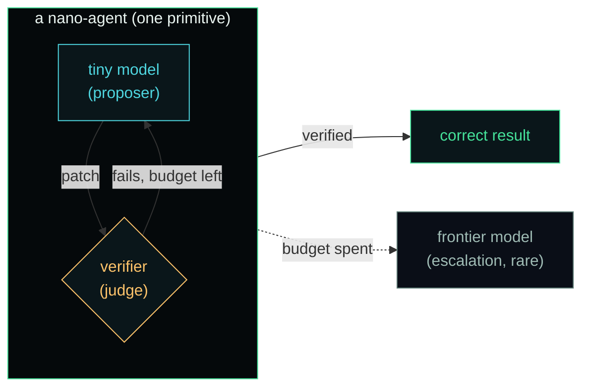
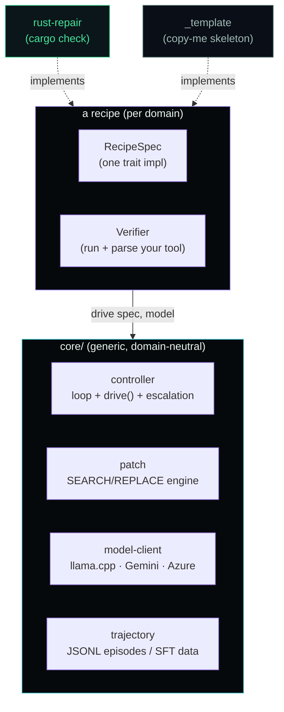
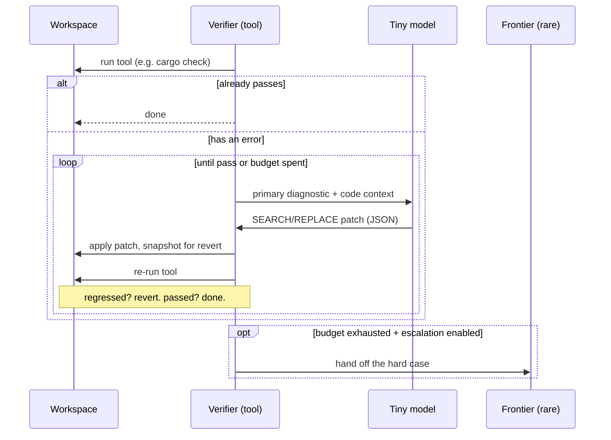

# nano-agent

[](https://doi.org/10.5281/zenodo.22293159)
[](LICENSE)
[](https://huggingface.co/mailtotanvir/nano-agent-rust-repair-0.5b)
[](https://mailtotanvir.github.io/nano-agent/blog.html)

**A framework for building nano-agents: tiny open-weight models wrapped into
self-contained, verifiable agent primitives.**

A nano-agent is not a chatbot and not a raw model. It is a small model
(0.1B–1.5B) fused with a deterministic control loop and a real tool's verifier,
so it can **act, check its own work, retry, and escalate** on its own — a single,
cheap, private unit of agency you can drop into a pipeline. The model proposes;
the verifier judges; the loop persists until the work is provably correct or the
budget is spent.

> The model is one component. The agent — model + verifier + patch engine +
> bounded retry + escalation — is the product. `nano-agent` is the framework that
> makes that agent, for any domain with a checkable output.

This is not "training small models." It is turning a small model into a
**standalone primitive agent**: give it a broken input and a way to check
correctness, and it drives itself to a verified result without a human, a large
model, or a network round-trip in the common case.

## Why nano-agents

The industry is pouring effort into making one very large model do everything.
But a huge share of real engineering work is not open-ended reasoning — it is
**bounded, structurally identifiable, and checkable**: fix the compiler error,
satisfy the linter, pass the schema, make the test go green. That work does not
need a frontier call on every step. It needs a competent specialist and a judge.



A nano-agent inverts the default economics of AI-assisted work:

- **Cheap** — the routine majority runs on a ~600 MB model on a CPU you already
  own, for a fraction of a cent instead of a metered frontier API call.
- **Private** — the code or data never leaves your infrastructure for the common
  case; the frontier is the exception path you control.
- **Verifiable** — every result is proven by a real tool (a compiler, a linter, a
  type checker), not asserted by a model. No hallucinated "done."
- **Composable** — each nano-agent owns one checkable domain, so you assemble
  fleets of them instead of routing everything through one giant model.

The proof of concept is [`rust-repair`](recipes/rust-repair/), where a 0.5B model
in the loop **beats the flash-class model that trained it** on held-out Rust
repair (72% vs 56%), running on a CPU. Full results in the
[paper](https://mailtotanvir.github.io/nano-agent/paper/nano-agent.pdf) and
[write-up](https://mailtotanvir.github.io/nano-agent/blog.html).

## The framework

`nano-agent` is a **recipe framework**. The generic machinery — the agent loop,
the patch engine, the model backends, the escalation logic — lives in `core/` and
is domain-neutral. A *recipe* teaches it one verifier. Adding a domain is
implementing a single trait; you never touch the loop.



Shared, recipe-agnostic machinery in [`core/`](core/):

- **`core/controller`** — the bounded verify→propose→apply→re-verify agent loop,
  the `Verifier` / `RecipeSpec` traits, the `drive()` entrypoint, and
  recipe-configurable frontier escalation. It does not know which language it
  repairs.
- **`core/patch`** — language-agnostic SEARCH/REPLACE patch engine (chosen over
  unified diff because tiny models mangle diff headers).
- **`core/model-client`** — the `ModelClient` trait with llama.cpp (tiny, CPU) and
  Gemini/Azure (frontier) backends; ships a GBNF grammar that forces valid
  contract JSON out of sub-1B models.
- **`core/trajectory`** — the JSONL episode schema used for both research logging
  and SFT training data.

A recipe is one [`RecipeSpec`](docs/recipe-framework.md) implementation — a
verifier factory, a system prompt, an escalation policy — plus a context builder
inside its verifier. See [`ARCHITECTURE.md`](ARCHITECTURE.md) for the full design
and [`docs/recipe-framework.md`](docs/recipe-framework.md) for the step-by-step
"add a recipe" walkthrough.

## How one nano-agent runs



Invariants that make it trustworthy: every touched file is snapshotted and
reverted if a patch fails or increases the error count (the loop never leaves a
workspace worse than it found it); the frontier teacher that generates training
data runs through the *exact same loop* as the tiny model, so trajectories are
shape-identical and every step is tool-verified.

## Recipes

| Recipe | Domain | Verifier | Status |
|---|---|---|---|
| [`rust-repair`](recipes/rust-repair/) | Rust compile errors | `cargo check` | reference implementation |
| [`_template`](recipes/_template/) | — | — | compilable skeleton — `cp -r` to start |

Planned: `sql-fix` (query validation), `tf-repair` (Terraform validate/plan).
The framework is built to be language-agnostic; a recipe is the only new code.

## Quick start (rust-repair)

```bash
# build the workspace
cargo build --release

# run the nano-agent on a broken crate (tiny model via a local llama.cpp server)
./target/release/rust-repair --path ./broken-crate --backend llama \
    --model qwen2.5-coder-0.5b-instruct

# tiny owns the routine; escalate the hard tail to a frontier model
./target/release/rust-repair --path ./broken-crate --backend llama \
    --escalate --escalation-backend gemini --escalation-model gemini-2.5-flash
```

Every run appends a full trajectory to `trajectories.jsonl` (initial diagnostics,
each proposal + applied patch + re-verify result, escalation, terminal outcome).

The trained reference model is on Hugging Face:
[`mailtotanvir/nano-agent-rust-repair-0.5b`](https://huggingface.co/mailtotanvir/nano-agent-rust-repair-0.5b).

## Add your own recipe

```bash
cp -r recipes/_template recipes/my-recipe   # already compiles + runs a no-op
# implement 4 TODOs: your Verifier's verify(), command(), default_file(),
# and the recipe's system prompt. Add the crates to the workspace. Done.
```

The skeleton builds and runs out of the box, so you always have a working
baseline. Full guide: [`docs/recipe-framework.md`](docs/recipe-framework.md).

## Development

```bash
cargo test --workspace           # unit + e2e (e2e needs cargo on PATH)
cargo clippy --workspace -- -D warnings
cargo fmt --check
```

## Paper & citation

The technical report is in [`paper/nano-agent.pdf`](paper/nano-agent.pdf)
(read it in your browser:
[mailtotanvir.github.io/nano-agent/paper/nano-agent.pdf](https://mailtotanvir.github.io/nano-agent/paper/nano-agent.pdf)).
The write-up is at
[mailtotanvir.github.io/nano-agent](https://mailtotanvir.github.io/nano-agent/blog.html),
and the trained model is on
[Hugging Face](https://huggingface.co/mailtotanvir/nano-agent-rust-repair-0.5b).

An archived, citable snapshot of this repository is on Zenodo:

> Ahmed, T. (2026). *nano-agent: A Tiny Model Beats Its Teacher — Verified-Loop
> Repair with a Sub-1B Language Model.* Zenodo. https://doi.org/10.5281/zenodo.22293159

DOI (all versions): [`10.5281/zenodo.22293159`](https://doi.org/10.5281/zenodo.22293159).
See [`CITATION.cff`](CITATION.cff).

## License

Apache-2.0. See [`LICENSE`](LICENSE).
